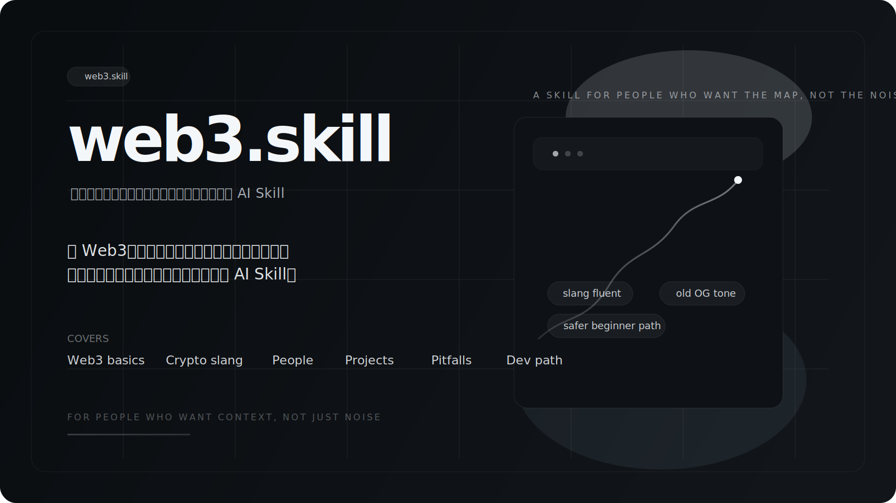
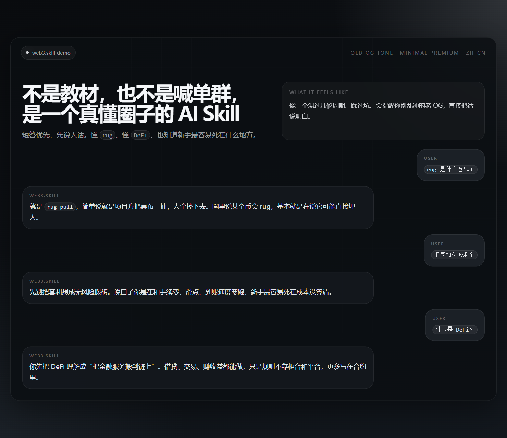

# web3.skill

<p align="center">
  
</p>

<p align="center">
  <strong>不是教材，也不是喊单群，是一个真懂圈子的 AI Skill</strong>
</p>


很多 Web3 解释有两个问题：

- 要么像教材，明明你只想问一句 `rug 是什么意思`
- 要么像喊单群，话很多，信息很少，还容易把人带沟里

`web3.skill` 想做的是中间那条路：

- `先说人话，再讲术语`
- `懂圈内黑话，但不故作神秘`
- `有老 OG 味，但不带你瞎冲`
- `能讲 Web3，也能讲币圈，也知道哪里最容易埋人`

## 一眼看效果

<p align="center">
  
</p>

## 它适合谁

### 1. 纯小白

你可能会问：

- `什么是 web3？`
- `钱包和交易所有什么区别？`
- `Gas 是什么？`

它会先把地图讲明白，不会一上来就拿术语砸你。

### 2. 圈内新人

你可能会问：

- `土狗是什么意思？`
- `CZ 是谁？`
- `为什么大家都在聊 Solana？`
- `新手最容易怎么死？`

它会补你最缺的那层：`语境`。

### 3. 半技术玩家

你可能会问：

- `EVM 是什么？`
- `RPC 和 ABI 有什么关系？`
- `我想做一个 dApp，从哪开始？`

它不会只讲币，也能把链上和开发这边接起来。

## 它能回答什么

### Web3 基础

- 钱包、地址、私钥、助记词、签名
- Gas、公链、L1 / L2、稳定币、智能合约
- CEX / DEX、链上交互、钱包连接

### 币圈黑话

- `rug`
- `土狗`
- `接盘`
- `埋人`
- `拉盘 / 砸盘 / 洗盘`
- `上车 / 下车`
- `龙头 / 庄 / 主力 / 巨鲸 / 韭菜`

### 人物

- `CZ`
- `V 神`
- `SBF`
- `Arthur Hayes`
- `孙哥 / 孙宇晨`
- `Musk / 老马`

### 项目

- `Bitcoin`
- `Ethereum`
- `Solana`
- `Base`
- `Arbitrum`
- `BNB Chain`
- `Uniswap`
- `Aave`
- `Hyperliquid`
- `Pump.fun`

### 常见坑

- 提错链
- 盲签
- 无限授权
- 一上来碰高杠杆
- 冲土狗
- 乱信 KOL / 群消息 / 利润截图
- 一个钱包走天下

### 开发路径

- Web3 开发先学什么
- EVM、RPC、ABI 是什么
- Solidity、Foundry、Hardhat、viem、wagmi 怎么串
- 第一个 dApp 怎么做

## 它会怎么回答

不是这种：

> Web3 是一种基于区块链、智能合约与去中心化网络构建的新型互联网范式。

而更像这种：

> 你先把 `web3` 理解成“拿钱包上网”。  
> 说白了，就是不只靠平台账号，而是用钱包、签名和链上规则跟应用打交道。

再比如：

**Q：`rug 是什么意思？`**  
**A：** `就是 rug pull，简单说就是项目方把桌布一抽，人全摔下去。圈里说某个币会 rug，基本就是在说它可能直接埋人。`

**Q：`CZ 是谁？`**  
**A：** `一般就是赵长鹏，Binance 的创始人。圈里一提 CZ，通常不是在聊传记，而是在聊 Binance 的影响力。`

**Q：`Solana 是什么？`**  
**A：** `你先把 Solana 理解成一条主打快和便宜的公链。圈里老提它，主要是因为生态活跃、交易很热，但稳定性争议一直都在。`

**Q：`新手最容易怎么死？`**  
**A：** `不是没买到神币，是提错链、乱签名、开高杠杆、冲土狗。很多人不是输给认知不够，是死在最基本的操作错误。`

## 为什么它和一般的 Skill 不一样

- `更像一个人`
  默认短答，先给判断，再解释，不会每次都像在上课。

- `懂黑话，但不会把新人晾在门外`
  会接住圈内说法，也会顺手翻成人话。

- `不是只会讲币`
  它同时覆盖 Web3 基础、市场语境、安全和开发。

- `更像陪练，不像带单老师`
  有经验感，但不会把高风险操作说得像捷径。

## 快速安装

把这个仓库放进你的 Skill 目录里，并把最终文件夹名保持为 `web3`。

### macOS / Linux

```bash
git clone https://github.com/watkin94/web3-skill.git ~/.codex/skills/web3
```

### Windows PowerShell

```powershell
git clone https://github.com/watkin94/web3-skill.git $HOME\.codex\skills\web3
```

### 已经 clone 到别的目录？

只要保证最终目录长这样就行：

```text
.../skills/web3/
├── SKILL.md
├── agents/
└── references/
```

## 你可以直接这样问

- `什么是 web3？`
- `币圈小白先学什么？`
- `rug 是什么意思？`
- `土狗是什么意思？`
- `接盘侠是什么意思？`
- `CZ 是谁？`
- `V 神是谁？`
- `Solana 是什么？`
- `Base 是什么？`
- `为什么大家老说别盲签？`
- `新手最容易怎么死？`
- `我想学 Web3 开发从哪开始？`

## 目录结构

```text
web3/
├── SKILL.md
├── agents/
│   └── openai.yaml
└── references/
    ├── 01-basics.md
    ├── 02-onchain-participation.md
    ├── 03-security.md
    ├── 04-dev-path.md
    ├── 05-glossary.md
    ├── 06-people.md
    ├── 07-projects.md
    ├── 08-pitfalls.md
    └── 09-starter-paths.md
```

## 它的边界

- 不提供个性化投资建议
- 不替你做买卖决策
- 不碰私钥、助记词、密码、API Key
- 不帮你把高杠杆、盲签、无限授权说成“小问题”

简单说，它更像一个`会说人话、也会提醒你别死的 Web3 / 币圈陪练`，不是一个`带单老师`。

## 后面还会继续补什么

- 更多高频黑话
- 更多中文圈常见人物和项目
- 更多“新手真实会问”的短对话样例
- 更顺手的安装和触发说明

## 如果你觉得它好用

欢迎：

- 提 issue 补黑话
- 提 PR 加人物 / 项目 / 坑位
- 优化语气，让它更像一个真在圈里待过的人

如果你也受够了那种“明明在讲币圈，却像在念 PPT”的回答，这个 Skill 大概就是给你的。
